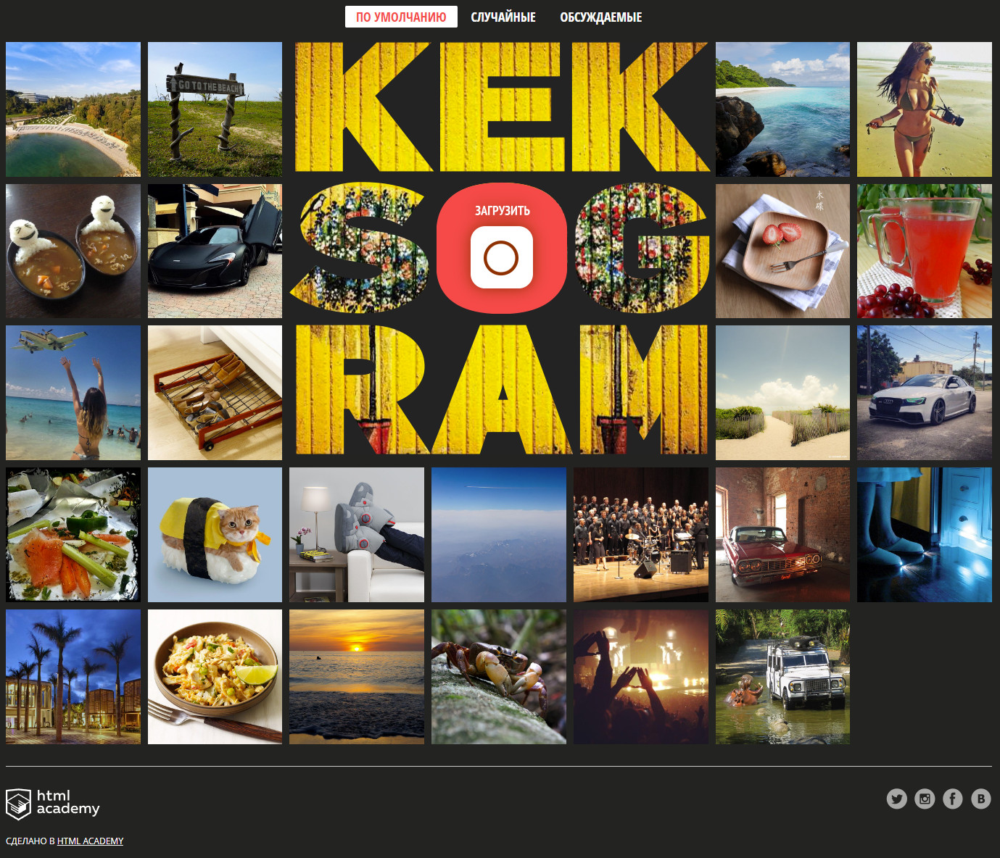
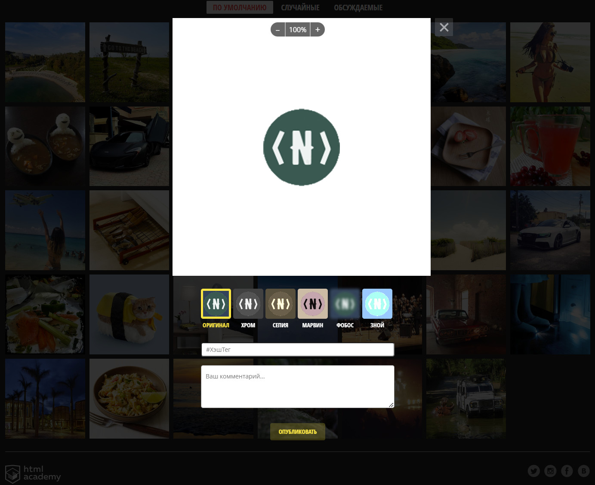
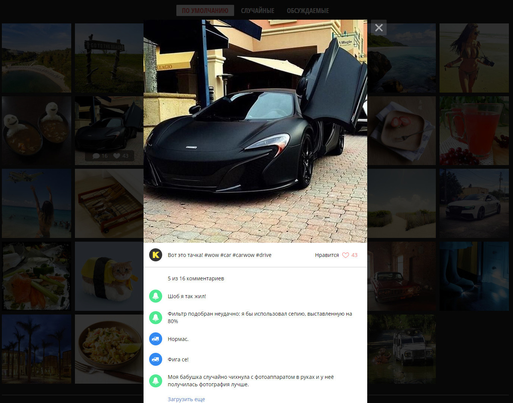

# Project «Кекстаграм»

## «Профессиональный JavaScript», уровень 1 от HTML Academy.

### Ссылка на gh-pages: https://navfront.github.io/Kekstagram/

### Стек:
- Ванильный JS
- Руки

 

### Описание проекта:
 Сервис просмотра фотографий. Пользователи могут выкладывать свои фотографии, предварительно редактируя их и накладывая фильтры. Можно просматривать фотографии других пользователей в полноэкранном режиме и комментарии к ним, а также фильтровать их по выбранному параметру.

